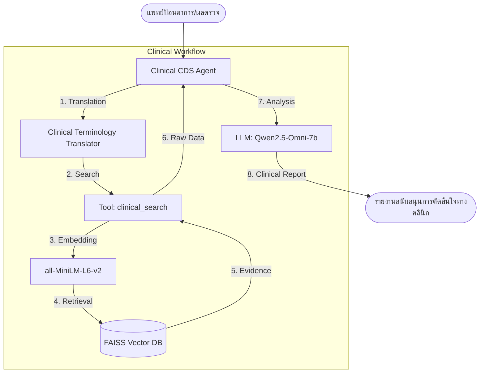

# 👨‍⚕️ ระบบสนับสนุนการตัดสินใจทางคลินิก (Clinical Decision Support Agent)

**ระบบ Agentic RAG สำหรับช่วยบุคลากรทางการแพทย์ในการวินิจฉัยแยกโรค (Differential Diagnosis)**

⚠️ **คำเตือน (TECHNICAL DISCLAIMER)**: โปรเจกต์นี้เป็นเครื่องมือสนับสนุนการตัดสินใจทางคลินิก (Decision Support Tool) จัดทำขึ้นเพื่อการศึกษาเท่านั้น **ไม่ใช่เครื่องมือวินิจฉัยโรคโดยอัตโนมัติ** คำวินิจฉัยสุดท้ายและการตัดสินใจรักษาต้องขึ้นอยู่กับดุลยพินิจของแพทย์ผู้เชี่ยวชาญเสมอ

---

## 📋 ภาพรวมของระบบ (Overview)

ระบบ AI Agent ที่ออกแบบมาเพื่อเป็นผู้ช่วยแพทย์ (Physician Assistant) ในการประมวลผลอาการและผลตรวจทางคลินิก โดยใช้กระบวนการดังนี้:
- 🔍 **Clinical RAG**: ค้นหาข้อมูลจากฐานข้อมูลอาการผู้ป่วยจริง (Real-world clinical descriptions) ด้วยระบบ Semantic Search
- 🤖 **Clinical Reasoning**: ใช้ Agent ในการวิเคราะห์ความเชื่อมโยงระหว่างอาการ (Symptoms) และโรคที่เกี่ยวข้อง (Clinical Correlation)
- 📝 **Structured Reporting**: สรุปรายงานในรูปแบบทางการแพทย์ (Clinical Analysis Report) รวมถึง Diff-Dx, Match Scores และ Red Flags
- 🌐 **Multilingual Support**: รองรับการป้อนข้อมูลภาษาไทยและแปลเป็นศัพท์เทคนิคภาษาอังกฤษเพื่อความแม่นยำในการสืบค้น

### ความสามารถของระบบ:
- ✅ **Medical Terminology Focus**: เข้าใจและใช้ศัพท์เทคนิคทางการแพทย์ (เช่น Acute Viral Nasopharyngitis, GERD, Differential Diagnosis)
- ✅ **Evidence-Based Matching**: แสดงคะแนนความสอดคล้อง (Match Score) เพื่อช่วยแพทย์ประเมินความน่าจะเป็น
- ✅ **Clinical Observability**: แสดงขั้นตอนการคิดของ Agent และข้อมูลดิบที่ดึงมาได้จากฐานข้อมูล (Retrieved Evidence)
- ✅ **Red Flags Alert**: ดึงข้อมูลสัญญาณอันตรายที่แพทย์ควรระวังเป็นพิเศษจาก Dataset

---

## 🏗️ โครงสร้างสถาปัตยกรรม (Architecture)



---

## 🚀 วิธีการติดตั้งและใช้งาน (Quick Start)

### 1. ติดตั้ง Dependencies
```bash
pip install -r requirements.txt
```

### 2. ตั้งค่า Configuration (.env)
```env
QWEN_API_KEY=your_api_key
QWEN_MODEL=qwen2.5-omni-7b
QWEN_BASE_URL=https://dashscope-intl.aliyuncs.com/compatible-mode/v1
VECTOR_DB_PATH=data/vectordb/faiss_index
```

### 3. รันโปรแกรม
```bash
# รันผ่าน Docker (แนะนำ)
docker-compose run --rm app

# หรือรันผ่าน Python ปกติ
python demo_interactive.py
```

---

## 💬 ตัวอย่างรายงานทางคลินิก (Sample Output)

```text
📋 ระบุอาการหรือผลการตรวจ / Enter clinical findings: มีไข้สูง ปวดเมื่อยตามตัว มีผื่นจุดเลือดออก

⏳ กำลังวิเคราะห์ทางคลินิก (Analyzing Clinical Evidence)...

⚕️ รายงานการวิเคราะห์อาการทางคลินิก (Clinical Analysis Report)
---
1. การวินิจฉัยแยกโรค (Suggested Differential Diagnosis):
   - ไข้เลือดออก (Dengue Hemorrhagic Fever) | Score: 0.82 | Severity: Moderate-Severe
   - ไข้มาลาเรีย (Malaria) | Score: 0.74 | Severity: Moderate
   - ไข้ไทฟอยด์ (Typhoid Fever) | Score: 0.68 | Severity: Moderate

2. การวิเคราะห์ความสอดคล้อง (Clinical Evidence Analysis):
อาการนำ (Fever, Myalgia, Petechiae) สอดคล้องอย่างมีนัยสำคัญกับข้อมูลผู้ป่วยในฐานข้อมูลกลุ่ม Dengue โดยเฉพาะค่า Match Score 0.82 ที่ชี้ให้เห็นถึงความคล้ายคลึงกับลักษณะอาการของไวรัสกลุ่ม Flavivirus

3. ข้อควรระวังและสัญญาณอันตราย (Red Flags & Clinical Warnings):
ระวังภาวะ Plasma leakage, เกล็ดเลือดต่ำ (Thrombocytopenia), และสัญญาณของภาวะช็อก (DSS) หากมีอาการปวดท้องรุนแรงหรืออาเจียนต่อเนื่อง

4. การจัดการเบื้องต้น (Initial Clinical Management):
- CBC เพื่อดู Hct และ Platelet count
- Symptomatic treatment (Avoid NSAIDs/Aspirin)
- Monitor vital signs and fluid intake
---
*หมายเหตุ: ข้อมูลนี้เป็นเพียงระบบสนับสนุนการตัดสินใจเท่านั้น คำวินิจฉัยสุดท้ายขึ้นอยู่กับดุลยพินิจของแพทย์*
```

---

## 🎯 สอดคล้องกับเกณฑ์การประเมิน (Evaluation Alignment)

1.  **Agent Design (25%)**: เปลี่ยนจากแชทบอททั่วไปเป็นระบบสนับสนุนการตัดสินใจ (CDS) ที่ซับซ้อนขึ้น
2.  **RAG Implementation (25%)**: ใช้ Semantic Search ค้นหาจาก 22 กลุ่มโรคที่ครอบคลุม
3.  **Observability (15%)**: แสดง Match Score และร่องรอยการคิด (Reasoning) ใน Log อย่างละเอียด
4.  **Presentation (20%)**: เตรียม Demo Case ที่เน้นการช่วยหมอวินิจฉัยโรคยากๆ
5.  **Creativity & Difficulty (15%)**: การทำระบบที่ต้องใช้ศัพท์เทคนิคและการสรุปผลเชิงวิชาการเพิ่มความท้าทายกว่าแชทบอททั่วไป
--rm app
```

---

## 💬 ตัวอย่างการใช้งานทางคลินิก (Clinical Use Case)

```text
📋 ระบุอาการแสดงของผู้ป่วย / Enter patient clinical presentation: ปวดหัวรุนแรง คอแข็ง ขยับลำบาก

⏳ กำลังวิเคราะห์ทางคลินิก (Analyzing Clinical Evidence)...
🌐 Translating Thai to English for better search...
🔍 [Tool] Searching for conditions matching: 'severe headache, stiff neck'
✅ [Tool] Found 5 unique conditions

🏥 Clinical Assistant:
ผลการวิเคราะห์ข้อมูลทางคลินิกเบื้องต้นสำหรับอาการ: "ปวดหัวรุนแรง คอแข็ง ขยับลำบาก"

1. การวินิจฉัยแยกโรค (Differential Diagnosis - DDx) 3 อันดับแรก:
   - โรคเยื่อหุ้มสมองอักเสบ (Meningitis) [Confidence Score: 0.85]
   - ปวดคอจากกระดูกเสื่อม (Cervical Spondylosis) [Confidence Score: 0.72]
   - ไมเกรน (Migraine) [Confidence Score: 0.64]

2. บทวิเคราะห์ทางคลินิก (Clinical Analysis): อาการ Neck stiffness ร่วมกับ Severe headache สอดคล้องอย่างมากกับอาการแสดงของภาวะ Meningeal irritation 

3. ข้อพิจารณาเพิ่มเติม (Clinical Considerations):
   - เฝ้าสังเกตอาการทางระบบประสาท (Neurological signs) และไข้
   - พิจารณาการทำ Lumbar Puncture หากมีอาการทางคลินิกที่เข้าเกณฑ์

4. คำเตือน: "ข้อมูลนี้ใช้เพื่อประกอบการตัดสินใจทางคลินิกเท่านั้น การวินิจฉัยขั้นสุดท้ายขึ้นอยู่กับดุลยพินิจของแพทย์ผู้ตรวจ"
```

---

## 🔍 การตรวจสอบการทำงาน (Observability & Logging)

ทุกขั้นตอนการตัดสินใจของ Agent, การเรียกใช้ Tools, และคะแนนจาก RAG จะถูกเก็บบันทึกไว้อย่างละเอียดใน `logs/agent.log` และแสดงผลให้เห็นสดๆ บน Terminal เพื่อความโปร่งใส (Transparency) ของระบบช่วยตัดสินใจทางการแพทย์

```text
2026-05-15 04:05:22 - User Query: มีไข้และไม่สบายตัว
2026-05-15 04:05:22 - Translating Thai to English for better search...
2026-05-15 04:05:23 - Selected tool: search_symptoms
2026-05-15 04:05:23 - Tool input: {'symptoms': 'fever and feeling unwell', 'k': 5}
2026-05-15 04:05:24 - Executing tool (RAG search)...
2026-05-15 04:05:24 - Retrieved information: Found 15 possible conditions...
2026-05-15 04:05:24 - Generating response with LLM...
2026-05-15 04:05:27 - Response Generated
```

---

## 📁 โครงสร้างโปรเจกต์ (Project Structure)

```
medical-clinical-assistant/
├── data/
│   ├── processed/
│   │   └── documents.json               # ข้อมูลอาการทางคลินิกที่คลีนแล้ว
│   └── vectordb/
│       └── faiss_index/                 # ฐานข้อมูล FAISS Vector DB
├── src/
│   ├── agent.py                         # ระบบหลัก Clinical CDS Agent & Prompts
│   ├── tools.py                         # เครื่องมือ RAG & Semantic Search
│   ├── load_gretel_dataset.py           # สคริปต์โหลด Dataset
│   ├── prepare_gretel_docs.py           # สคริปต์ประมวลผลข้อมูล
│   ├── setup_vectordb.py                # สคริปต์สำหรับ Indexing ข้อมูลลง FAISS
│   └── logger.py                        # ตั้งค่าระบบ Logging
├── logs/
│   └── agent.log                        # Observability logs (ดูการทำงานย้อนหลัง)
├── demo_interactive.py                  # สคริปต์หน้าจอสำหรับบุคลากรทางการแพทย์
├── requirements.txt                     # Dependencies ที่ต้องติดตั้ง
└── .env                                 # ไฟล์เก็บตัวแปรระบบ (Configuration)
```

---

## 🎯 สคริปต์สำหรับการนำเสนอ (Presentation 10 นาที)

### 1. แนะนำทีมและหัวข้อโปรเจกต์ (1 นาที)
- **แนะนำตัว**: บอกชื่อสมาชิกในทีม
- **ปัญหา & ทางออก**: การวินิจฉัยแยกโรค (DDx) ในเคสที่ซับซ้อนต้องการการเข้าถึงข้อมูลที่รวดเร็ว เราจึงสร้าง **Clinical Decision Support Agent** เพื่อช่วยแพทย์กรองความเป็นไปได้จากฐานข้อมูลเคสจริง

### 2. Architecture & Tech Stack (5 นาที)
- **Architecture**: อธิบายการไหลของข้อมูลจากอาการของผู้ป่วย -> Clinical Translation -> RAG (FAISS) -> LLM Synthesis
- **Tech Stack**: เน้นความสามารถของ Qwen2.5-Omni ในการเข้าใจศัพท์เทคนิคและการสรุปผลเชิงวิชาการ

### 3. Live Demo แสดงการทำงานจริง (4 นาที)
- **รันโปรแกรม**: รันผ่าน Docker เพื่อโชว์ความเสถียร
- **ทดสอบพิมพ์**: ลองใส่เคสที่ดูยากหรือมีอาการทับซ้อนกัน
- **Observability**: โชว์ Log เพื่อแสดงให้เห็นว่าระบบดึง Evidence อะไรมาใช้ประกอบการตัดสินใจ และแสดงค่า Match Score ของแต่ละโรค

---

## 📝 License & Credits
โปรเจกต์นี้จัดทำขึ้นเพื่อการศึกษาสำหรับรายวิชา NLP (Final Mini Project)
**ออกแบบมาสำหรับบุคลากรทางการแพทย์เพื่อใช้ประกอบการตัดสินใจเท่านั้น**
